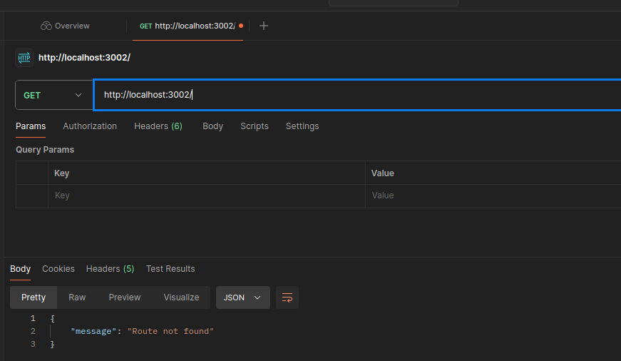
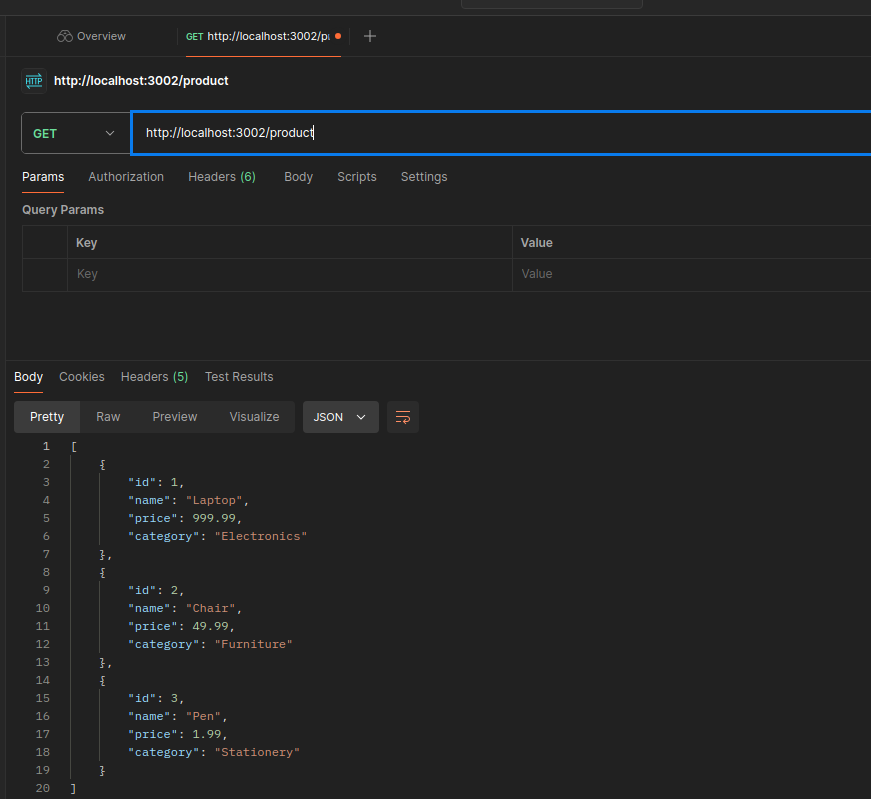
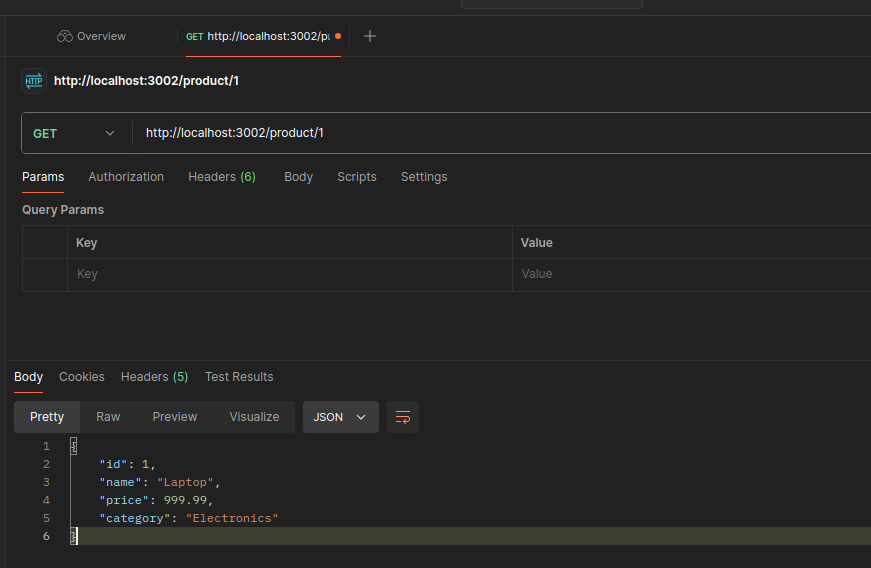

PASOS API PRODUCTS:
1. Importar las librerías http, path, fileURLToPath, dirname y fs.
2. Crear los productos por medio de un archivo JSON.
3. Leer los datos de los productos desde el archivo json el cual es: products.json
    3.1. Los datos se leen por medio de las funciones fileURLToPath y dirname.
4. Se crea una funcion que ayude a leer el archivo JSON.
5. Se define el puerto en el cual el servidor va a "escuchar".
6. Se crea el servidor con http.createServer
    6.1. Dentro de la función se valida con if else, si se usa el methodo GET y su el path es product, para devolver los datos del archivo JSON.
    6.2. Si se encuentra la ruta, la api retorna los valores.

A continuación se muestran los screenshots de postman.

