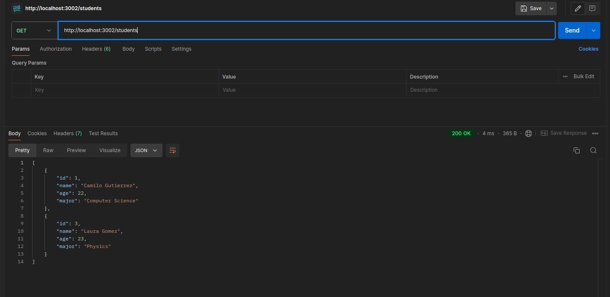
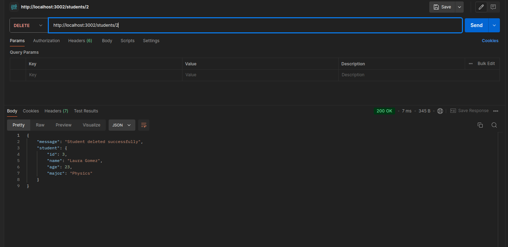
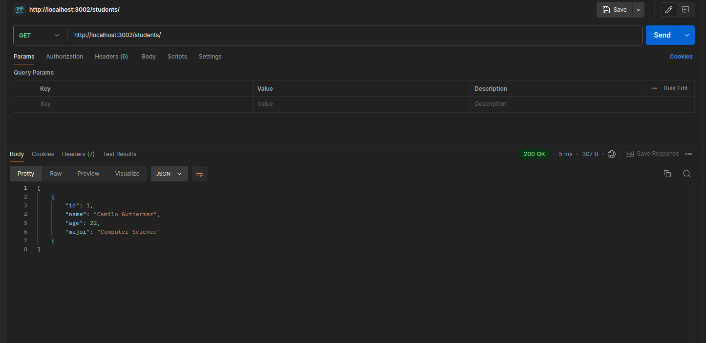

Pasos Tarea 7:

1. Importar librerías express, fs y path
2. Se crea la constante app de la librería express, y tambien se crea el puerto donde va a funcionar el servidor.
3. Se lee el archivo json por medio de path.join
4. Del archivo que se lee con path join se crea una funcion para obtener los datos del archivo.
5. Se crea la funcion de actualizar datos del archivo json, por medio de la librería fs usando writeFileSync.
6. Se crea el endpoint get de /students para obtener los datos del archivo json.
7. Se crea el endpoint get para obetner los esudiantes por Id. Por medio del metodo find, se recorre el archivo json para encontrar el ID requerido por el usuario.
8. Se crea el endpoint delete para borrar el estudiante que quiera el usuario, usando la misma url que se usó para conseguir los datos por ID, pero es usa el metodo DELETE por medio de POSTMAN. 
    8.1. Se usa un If para determinar si el ID digitado en la url se encuentra en el archivo JSON. Si e encuentra se procede a usar el metodo splice para borrar este item del json.
    8.2. Se acualiza el archivo json con el nuevo arreglo llamado students. Y se responde el endpoint delete, confirmando que se borro exitosamente el ID.

A continuacion se muestran los screenshots de  POSTMAN:

